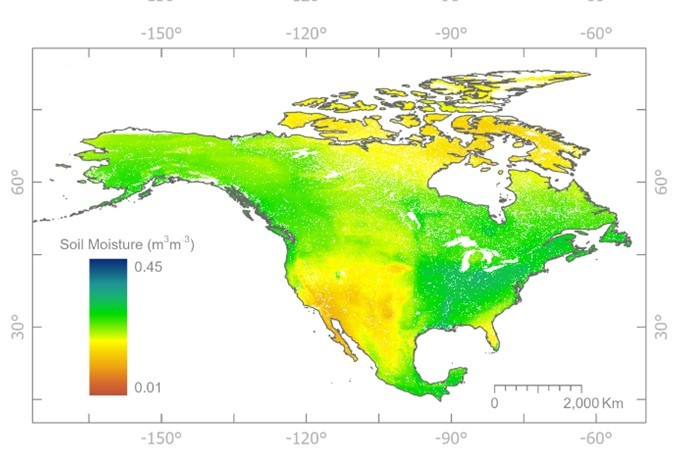

# NASMo-TiAM: North America Soil Moisture Dataset Derived from Time-Specific Adaptable Machine Learning Models

NASMo-TiAM is a workflow for generating soil moisture for North America at 250 m resolution using time-specific adaptable Machine Learning (ML) models. This workflow is composed of five steps:

(i) uses a combination of static and dynamic standardized input data, 
(ii) preprocesses it to allocate the same temporal and spatial characteristics, 
(iii) transforms it into an ML training and testing format, 
(iv) trains and tests a traditional ML model such as Random Forest to perform soil moisture prediction
(v) validates the predictions with available high-resolution soil moisture data

The current version of NASMo-TiAM uses Random Forest to perform surface Soil Moisture (0-5cm depth) predictions at 250m of spatial resolution on 16-day periods from mid-2002 to December 2020 over North America. The generated data can be found in the [ORNL DAAC](https://daac.ornl.gov/CMS/guides/NASMo_TiAM_250m.html). 

<p align="center">
    
    <br>
    <em>Figure 1. Figure 1. Random Forest predictions of mean volumetric soil moisture values for North America derived from 426 biweekly periods from 2002 to 2020.</em>
</p>

## Prerequisites and Dependencies
To run this workflow, you must have [R>4.0](https://cran.r-project.org/bin/linux/ubuntu/fullREADME.html#installing-r) and [Python>3.8](https://www.python.org/downloads/). The R packages are listed in `install/R-dependencies.R` and for Python in `install/Python-dependencies.txt`.  

## Installation
Currently, the installation is supported on Debian, and Debian-based Linux distributions. This script installs all the necessary packages (R>4, R libraries, pip, Python libraries) for your local computer.
Requirement: Debian-based Linux distributions.
```
git clone --recursive https://github.com/TauferLab/NASMo-TiAM.git
cd NASMo-TiAM/install
./install.sh
```

If you already have R>4.0 and Python>3.8 installed on your local machine, you will only need to install the dependencies by running the next commands.
```
# Install R libraries
sudo Rscript R-dependencies.R

# Install Python libraries
sudo python3 -m pip install -r Python-dependencies.txt
```

## Using - Running
List all the steps to run your project as well as the different arguments or options you have to execute it.

## Related Publications
Llamas, R., P. Olaya, M. Taufer, and R. Vargas. 2024. North America Soil Moisture Dataset derived from Time-specific Adaptable Machine learning models (NASMo-TiAM 250m). In Preparation for Scientific Data, 2024.

## Copyright and License 
Copyright (c) 2023, Global Computing Lab

NASMo-TiAM is distributed under terms of the [Apache License, Version 2.0](http://www.apache.org/licenses/LICENSE-2.0) with LLVM Exceptions.
See [LICENSE](https://github.com/TauferLab/GCLab_Code_Repo_Template/blob/main/LICENSE) for more details.

## Acknowledgments
This study was funded by NASA’s Carbon Monitoring System program (grant 80NSSC21K0964) and the National Science Foundation's Office of Advanced Cyberinfrastructure (grants 2103845 and 2103836).
Any opinions, findings, conclusions, or recommendations expressed in this material are those of the author(s) and do not necessarily reflect the views of the National Science Foundation. 

## Contact Information
Please, contact the main developer directly Dr. Ricardo LLamas (rllamas@udel.edu), or the SOMOSPIE PIs, Dr. Michela Taufer (mtaufer@utk.edu) and Dr. Rodrigo Vargas (rvargas@udel.edu).
