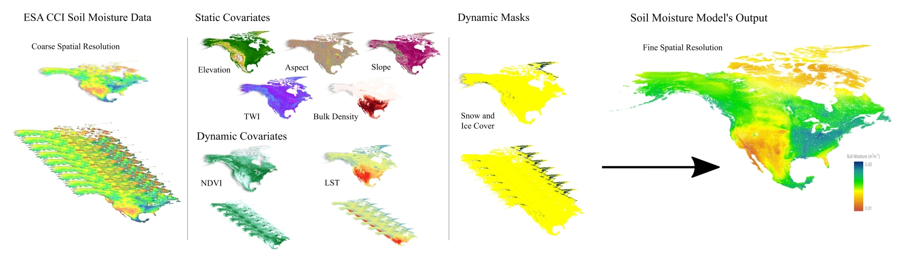

# NASMo-TiAM: North America Soil Moisture Dataset Derived from Time-Specific Adaptable Machine Learning Models

NASMo-TiAM is a workflow for generating soil moisture for North America at 250 m resolution using time-specific adaptable Machine Learning (ML) models. It deploys ML models to downscale coarse-resolution soil moisture estimates (0.25 deg) from the [European Space Agency Climate Change Initiative (ESA CCI)](https://climate.esa.int/en/projects/soil-moisture/data/) based on their correlation with a set of static (terrain parameters, bulk density) and dynamic covariates (Normalized Difference Vegetation Index, land surface temperature).

This workflow is composed of five steps.

1. [Input Data:](1_Input_Data/) It uses a combination of coarse-resolution soil moisture and static and dynamic standardized input data,
2. [Data Preprocessing:](2_Data_Preprocessing/) It preprocesses it to allocate the same temporal and spatial characteristics,
3. [Matrices Generation:](3_Matrices_Generation/) It transforms it into an ML training and testing format,
4. [ML Training Prediction:](4_ML_Training_Prediction/) It trains and tests a traditional ML model such as Random Forest to perform soil moisture prediction, and
5. [ML Validation:](5_ML_Validation/) It validates the predictions with available high-resolution soil moisture data.

Each step has its directory with the data sources, scripts, and a README file describing in detail the execution steps.   

The current version of NASMo-TiAM uses Random Forest to perform surface Soil Moisture (0-5cm depth) predictions at 250m of spatial resolution on 16-day periods from mid-2002 to December 2020 over North America. The generated data can be found in the [ORNL DAAC](https://daac.ornl.gov/CMS/guides/NASMo_TiAM_250m.html). 

<p align="center">
    
    <br>
    <em>Figure 1. The NASMo-TiAM 250 m workflow involved standardizing input data to common spatial and temporal resolutions, integrating static and dynamic covariates, and training a Random Forest model to output fine scaled soil moisture across North America.</em>
</p>

## Motivation
Soil moisture plays a crucial role in the Earth's ecosystems and has substantial implications in different scientific fields such as hydrology (Jackson et al., 1996; Robinson et al., 2008), ecology, and climate science (Davidson et al., 1998; Falloon et al., 2011; Legates et al., 2010; Ward, 2008). A greater understanding of soil moisture processes and their spatial and temporal distribution can lead to improvements in different fields, such as agriculture (Engman, 1991; Hunt, 2015; Pablos et al., 2017), water resources management (Jacobs et al., 2003), natural disasters related to flooding (Tuttle et al., 2017), landslides (Crow, 2019), and drought events (Pablos et al., 2017). 

This NASMo-TiAM 250 m dataset provides a fine spatial resolution soil moisture dataset across the North American region. Other continent-scale datasets have resolutions ranging from 0.25 degrees (O. and Orth, 2021) to 25 km (Skulovich and Gentine, 2023) and 1 km (Han et al., 2023). While the dataset from Vergopolan et al. (2021) has a 30-m resolution, its spatial coverage is limited to the conterminous United States.

## Prerequisites and Dependencies
To run this workflow, you must have [R>4.0](https://cran.r-project.org/bin/linux/ubuntu/fullREADME.html#installing-r) and [Python>3.8](https://www.python.org/downloads/). The R packages are listed in `install/R-dependencies.R` and for Python in `install/Python-dependencies.txt`.  

## Installation
Currently, the installation is supported on Debian, and Debian-based Linux distributions. This script installs all the necessary packages (R>4, R libraries, pip, Python libraries) for your local computer.
Requirement: Debian-based Linux distributions.
```
git clone --recursive https://github.com/TauferLab/NASMo-TiAM.git
cd NASMo-TiAM/install
./install.sh
```

If you already have R>4.0 and Python>3.8 installed on your local machine with a different operating system (Linux, Windows, or Mac), you will only need to install the dependencies by running the next commands.
```
# Install R libraries
sudo Rscript R-dependencies.R

# Install Python libraries
sudo python3 -m pip install -r Python-dependencies.txt
```

## How to Run
This workflow includes five steps where you will need to access each of the steps to learn more about the execution. **You need to follow the order so all data dependencies are in place.**

1. [Input Data](1_Input_Data/)
2. [Data Preprocessing](2_Data_Preprocessing/) 
3. [Matrices Generation](3_Matrices_Generation/)
4. [ML Training Prediction](4_ML_Training_Prediction/)
5. [ML Validation](5_ML_Validation/)

## Related Publications
Llamas, R., P. Olaya, M. Taufer, and R. Vargas. 2024. North America Soil Moisture Dataset derived from Time-specific Adaptable Machine learning models (NASMo-TiAM 250m). In Preparation for Scientific Data, 2024.

## Copyright and License 
Copyright (c) 2023, Global Computing Lab

NASMo-TiAM is distributed under terms of the [Apache License, Version 2.0](http://www.apache.org/licenses/LICENSE-2.0) with LLVM Exceptions.
See [LICENSE](https://github.com/TauferLab/GCLab_Code_Repo_Template/blob/main/LICENSE) for more details.

## Acknowledgments
This study was funded by NASA’s Carbon Monitoring System program (grant 80NSSC21K0964) and the National Science Foundation's Office of Advanced Cyberinfrastructure (grants 2103845, 2103836, and 2334945).
Any opinions, findings, conclusions, or recommendations expressed in this material are those of the author(s) and do not necessarily reflect the views of the National Science Foundation. 

## Contact Information
Please, contact the main developer directly Dr. Ricardo Llamas (rllamas@udel.edu), or the SOMOSPIE PIs, Dr. Michela Taufer (mtaufer@utk.edu) and Dr. Rodrigo Vargas (rvargas@udel.edu).
